#  Parcel Delivery Optimization using Reinforcement Learning Algorithms

## Admin View Images from the Project

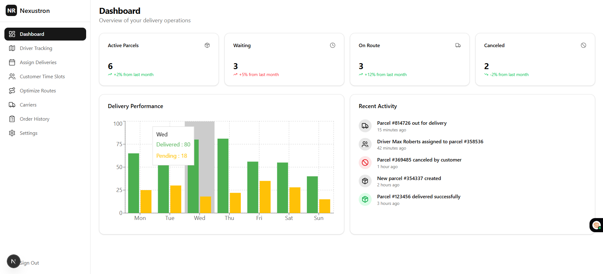
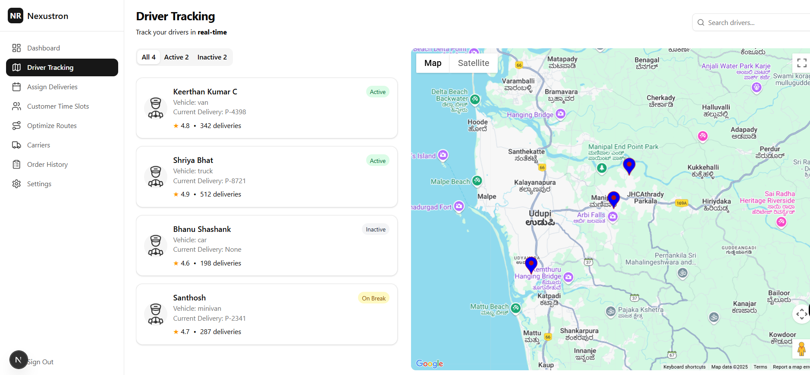
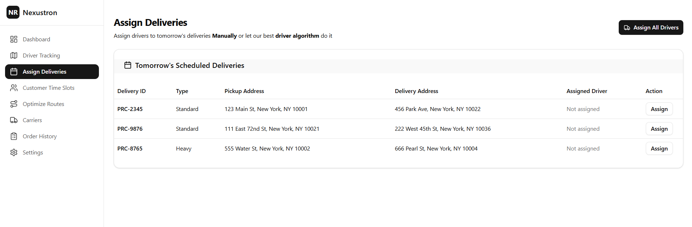
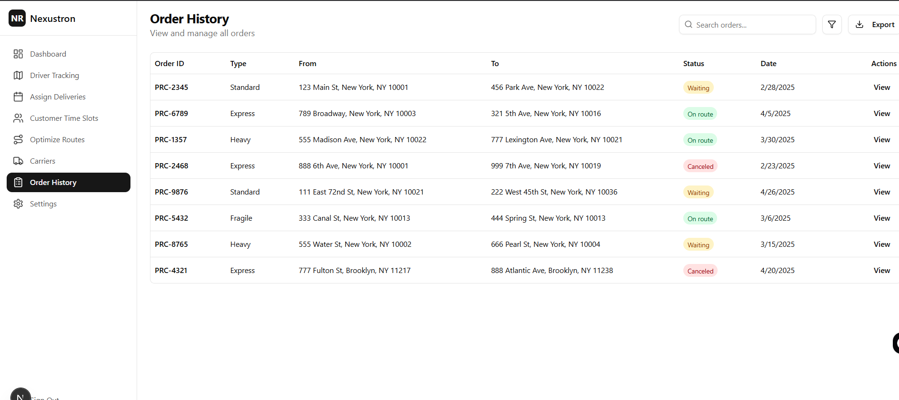
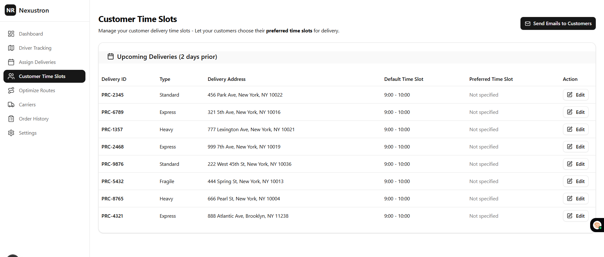
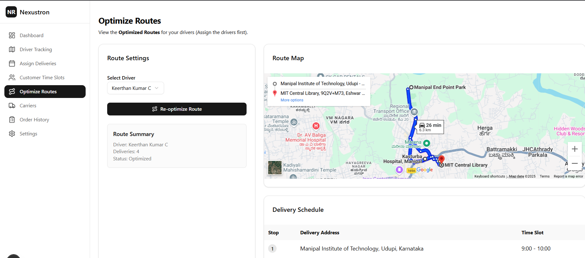
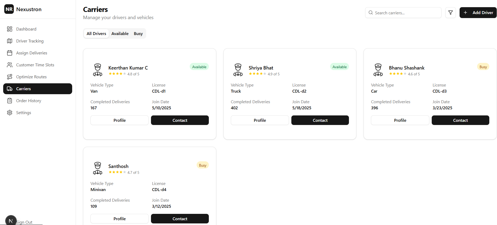

## Driver View Images from the Project

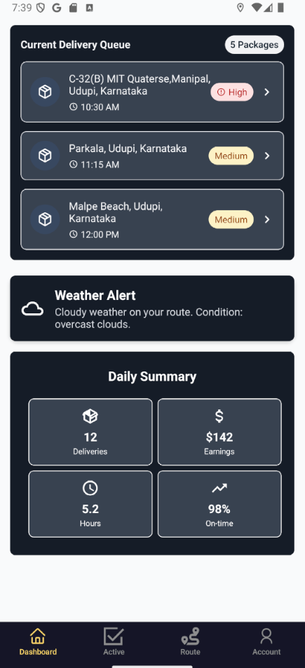
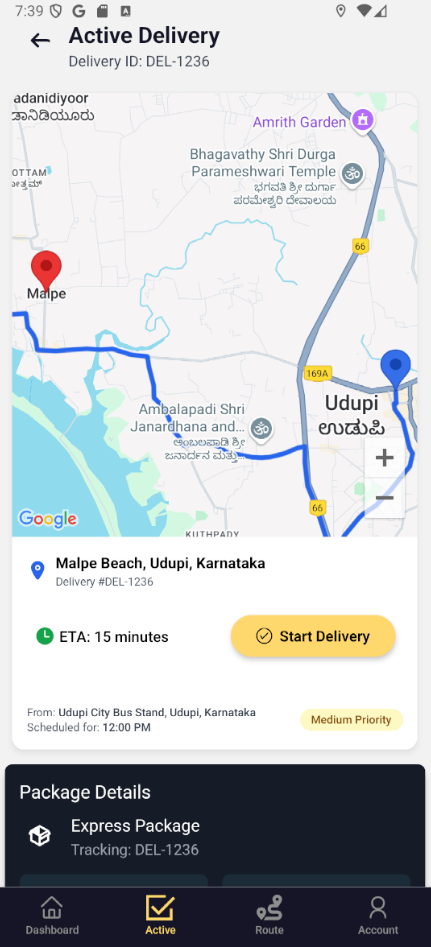
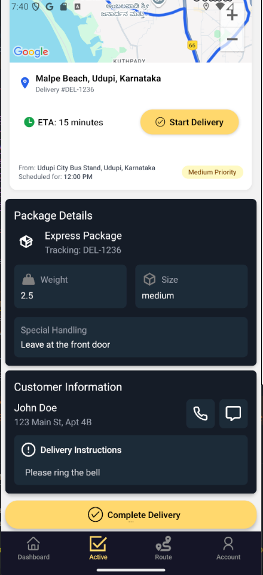
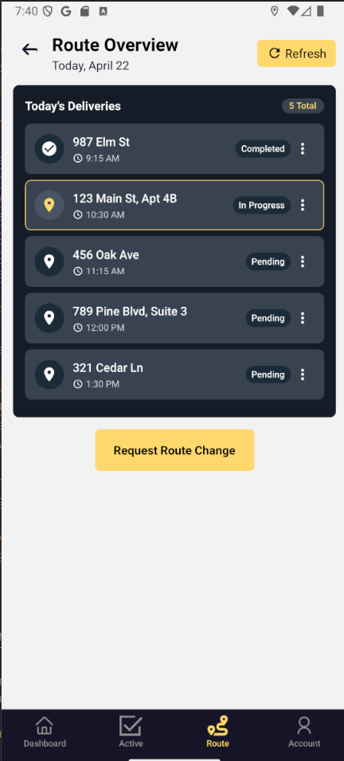
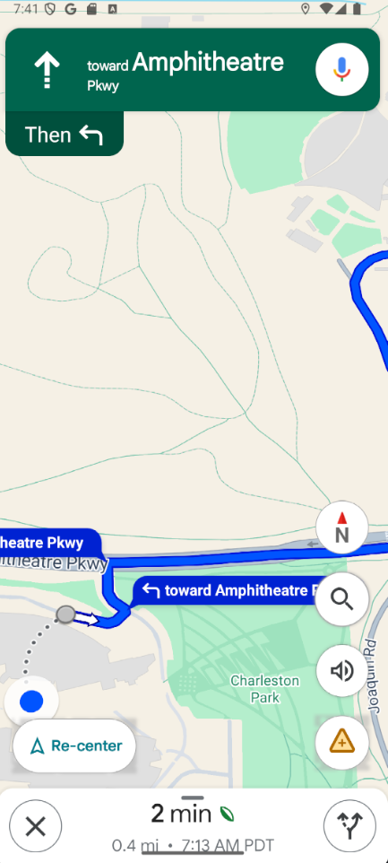
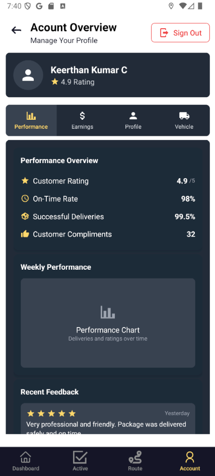

This project optimizes parcel delivery routes using RL Algorithms.

## Features
-  **Realistic delivery environment** using OSM road network and delivery data  
-  **Trained agent** to optimize routes and delivery timing  
-  (internal--->evaluation and visualization of agent performance, map-based route plotting with delivery points and depot)

- Admin Dashboard to optimize the routes for the day(get the optimal delivery sequence + Assign them to the drivers)
- Delivery Person website - to get details of the delivery, mark the task as complete/incomplete, and contact the customer

## Model 1: Deep Q Learning
## Model 2: Google OR Tools with ML Layer to modify the matri based on several features like day of week, month, is_weekend, is_rush_hour, is_night, temperature, humidity, weather_condition, wind_speed, visibility, package_weight, etc that learns on custom data.
## Model 3: To be decided
